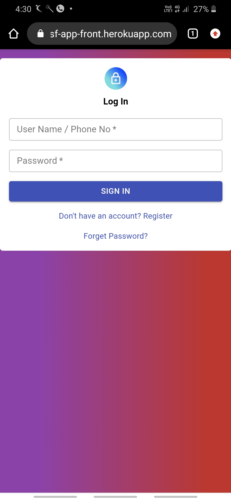
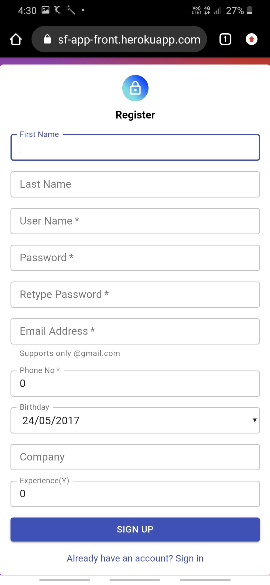
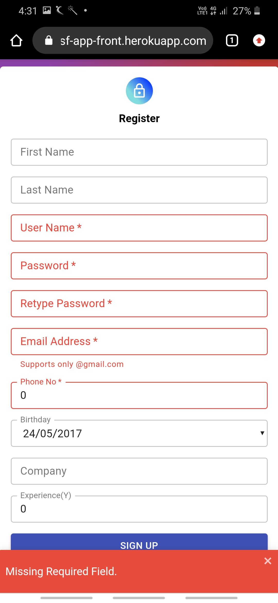
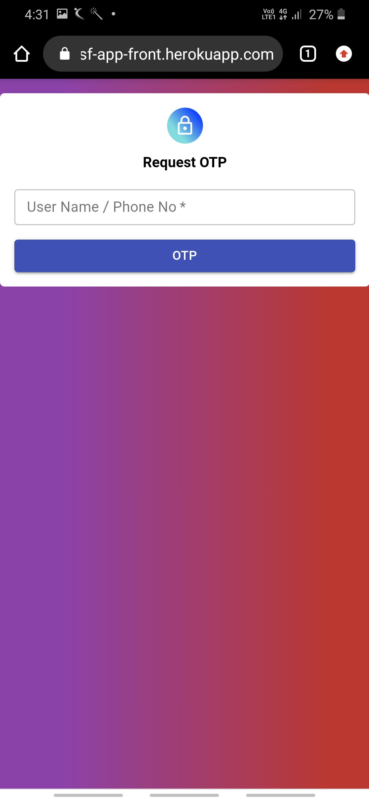
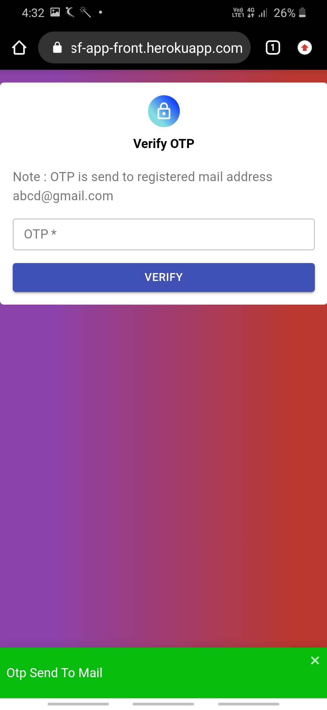
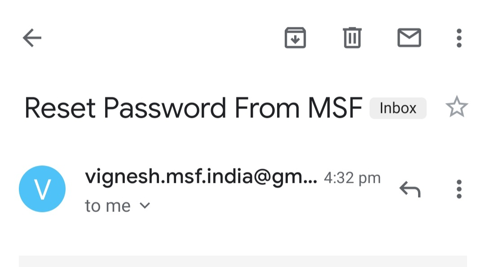
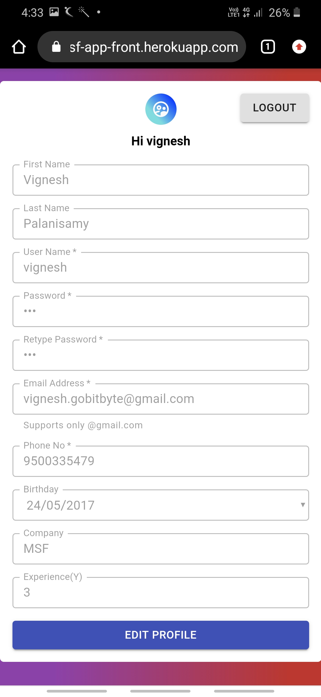

# msf-app-front
Front Repository For System Task In Market Simplified

Requirements :
1. Node / npn
2. Postgresql pgAdmin

Steps to run : 
1. npm i
2. npm build or npm react-scripts build
3. npm start

Need to change :

1. In ENV file :
   1. Change DATABASE_URL and SCHEMA to your local postgresql config
   2. Change CROS_ORIGIN to your localhost with port. Example http://localhost:3000 (due to PORT in env is 3000)

2. In dir src/utils/serverUtil.js:
   1. Change server ip to your localhost in serverIp() method. Example http://localhost:3000

Note:
1. Both front and service run with same ip and same port. Hence CROS_ORIGIN and ServerIp will be same here.
2. While server start, database table get dropped (if exists) and recreate again.
3. SQL query in dir server/SQL
4. Sample postman references in dir server/Postman
5. Server implementation starts with dir server/Controller/Controller.js

Deployment detils:

1.Deployment - Heroku 

2.LIVE URL -  https://msf-app-front.herokuapp.com/

3.API Documentation - https://app.swaggerhub.com/apis/student5447/MsfApiDocumentation/1.0.0

For any queries:

Contact : 

Vignesh Palanisamy .

vignesh.gobitbyte@gmail.com

9500335479

Sample:

